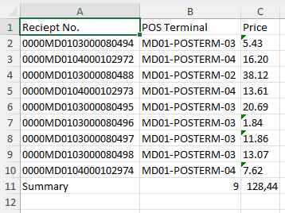
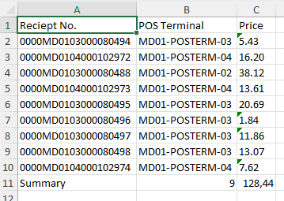

# Trassir_SDK

> #### With this script, we can find out the passability of people in a certain period of time

* #### First Step
  * #### Connect to our trassir server to generate SID 
* #### Second step
  * #### Connect to ActivePos events (_ACTIVEPOS MODULE ON TASSIR_)
* #### Third step
  * #### Create xlsx file, validate and write data

----
## _FINISH_:
###  As a result, we get an xlsx file with data on transactions in the directory (Number of transactions from 10-11, 11-12, etc., the amount of transactions in these intervals)

----